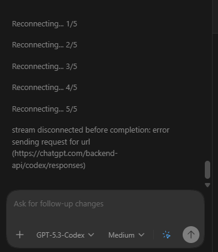
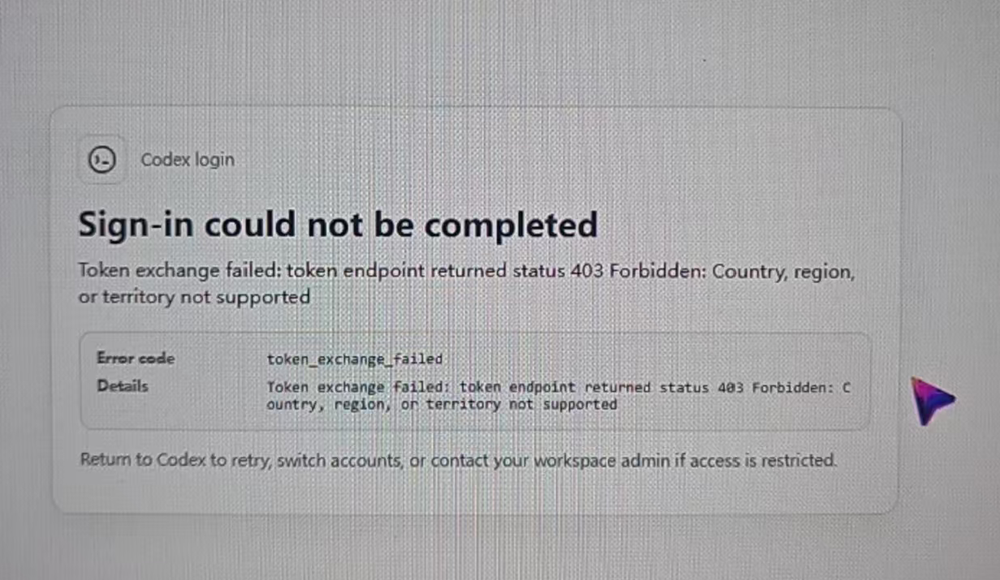
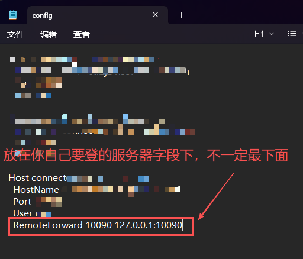
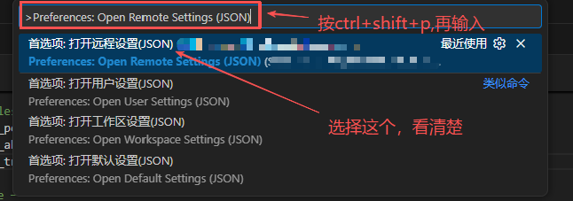
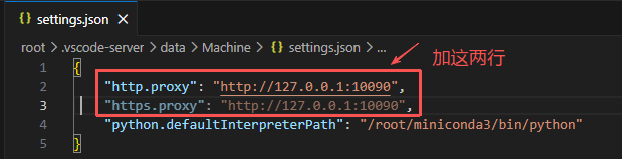
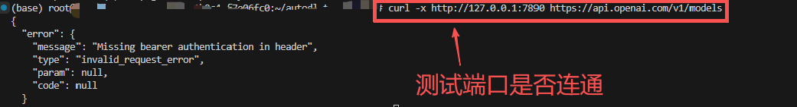

# VSCode-Codex-Connection-Issues

> [English](README.md) | [中文](README.zh-CN.md)

> Fix VS Code Codex connection problems: login failures, endless "Reconnecting…", stuck at "Thinking", plus a complete SSH + proxy forwarding setup for remote GPU servers (AutoDL / Jijiyun / Tencent Cloud).

 

## Background

When using the Codex extension in VS Code over SSH to a remote GPU server, the extension often cannot reach the Codex service: it keeps showing "Reconnecting…", the login page never finishes, or the chat stays at "Thinking" forever. Local connections usually work, which means the remote environment cannot reach your local proxy / VPN.

This guide provides the complete fix: forward your local VPN proxy port into the remote server over SSH, configure the remote VS Code proxy settings, and verify connectivity.

## Symptoms

- Codex keeps showing "Reconnecting…";
- Login fails or hangs;
- Stuck at "Thinking" with no response;
- Works locally, fails only inside VS Code Remote (SSH).





## Quick fix (5 steps)

### Step 1: Find your VPN proxy port

Check the local proxy port of your VPN ("magic ladder"). The examples below use `10090`; some clients use `7890`.


### Step 2: Forward the port in your SSH config

Open `C:\Users\<your-username>\.ssh\config` with any text editor, and add the following line inside the server block:

```
RemoteForward 10090 127.0.0.1:10090
```

Then save the file.



### Step 3: Open Remote Settings (JSON)

Connect to the server, open VS Code, press `Ctrl+Shift+P`, type `Preferences: Open Remote Settings (JSON)`, and choose the first matching item (usually the first result).



### Step 4: Add the proxy settings

Add these two lines (note the commas) and save:

```json
"http.proxy": "http://127.0.0.1:10090",
"https.proxy": "http://127.0.0.1:10090",
```



### Step 5: Restart VS Code and verify

Restart VS Code, then run the following in the server terminal:

```bash
netstat -tuln | grep 10090
```

If the port shows as listening, the forwarding is working.



## Important notes

- Always use the port your VPN actually listens on (e.g., `10090` or `7890`) consistently in both the SSH config and the proxy settings — some VPN clients only support `7890`.
- Make sure Codex can log in on your local machine first; this rules out VPN node issues.
- If it still does not work, restart VS Code or the VPN client.

## FAQ

**Q1: Which port should I use?**
Use the port your VPN client actually listens on. The guide uses `10090` as an example; many clients use `7890`.

**Q2: Do I need to change anything on the server?**
No. `RemoteForward` forwards your local port to the server automatically — no extra system configuration is needed on the server side.

**Q3: It still says "Reconnecting…" after all steps?**
Restart VS Code and the VPN. If the server is in a network with restricted access, try a different VPN node.

## Project layout

```
VSCode-Codex-Connection-Issues/
├── README.md                    # English documentation
├── README.zh-CN.md              # Chinese documentation
├── LICENSE / .gitignore
└── docs/
    └── images/                  # Tutorial screenshots
        ├── login-issue.png
        ├── reconnecting-issue.png
        ├── vpn-proxy-port.png
        ├── ssh-config.png
        ├── open-remote-settings.png
        ├── remote-settings-json.png
        └── test-port.png
```

## License

MIT
